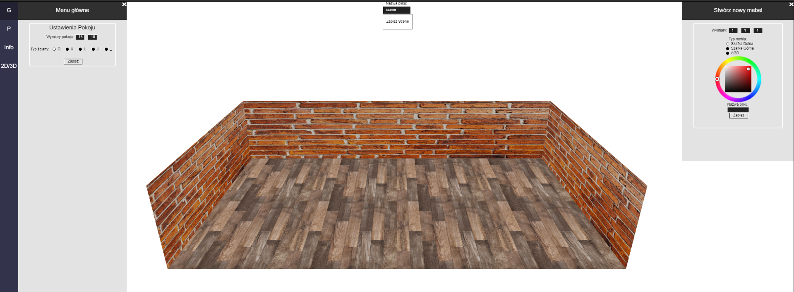
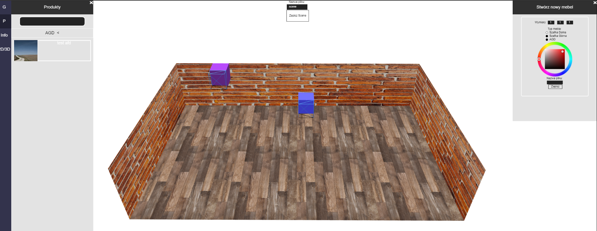
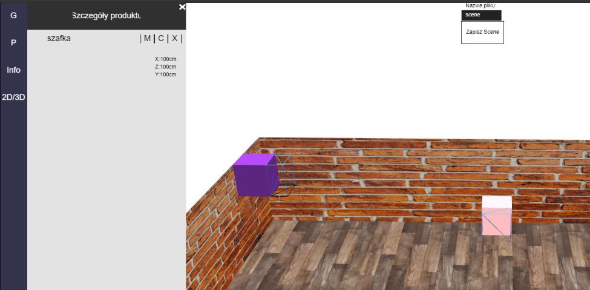
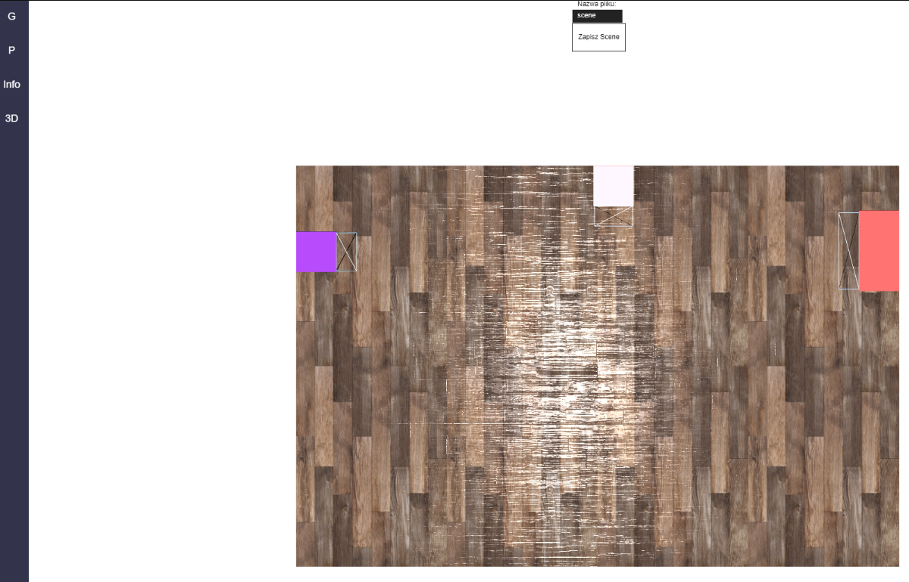

## Interior design app (school project)

application to facilitate room design

**Install:**
npm install\
**Run:**
npm start\

The application supports designing the room interior with sample cube-shaped furnitures that are dragged from the gui into the scene. The application allows creating new furnitures in customised sizes and colours and for customised purposes (e.g. top cupboard, bottom cupboard, which influences their placement in the scene), as well as serialising the scene and the created furniture into json files. Deserialisation is not possible at the moment.

### Screenshots

| Images                            | Images                            |
| --------------------------------- | --------------------------------- |
|  |  |
|  |  |
